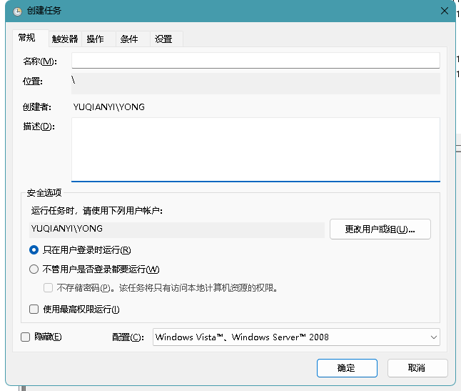
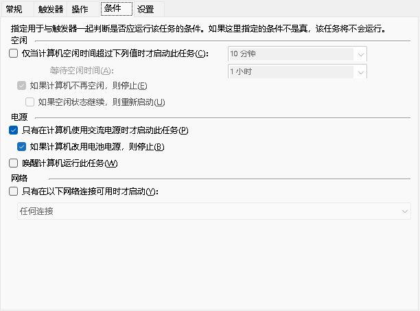
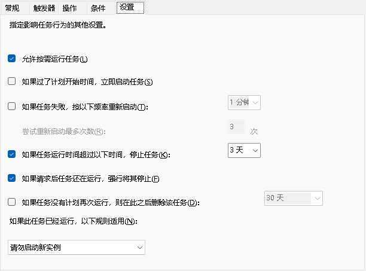

# 开源库目标

> 通过Qt调用`WinAPI`来添加修改`windows`的`计划任务程序`，来方便开发者通过`Qt`来开发程序使`自身`程序加入到`计划任务程序当中`。
>
> 通过`计划任务程序`最大的`优势`是可以通过`系统账户管理员账户运行`，而不像`注册表`和`启动文件夹`将`使用当前登录账户`的`权限`。
>
> * [x] 完成创建任务计划程序的封装
> * [x] 完成 常规设置 接口测试
> * [x] 完成 添加操作 接口测试
> * [x] 完成与触发器一起判断是否应运行该任务的条件
> * [x] 完成影响任务行为的其他设置
> * [x] 完成 影响任务钟和触发器相关的配置兼容性
> * [x] 完成触发器配置
> * [x] 完成API 调用实例
> * [ ] 后续功能完善

# 编译环境

>  在`MinGW`对`触发器`的`部分操作` 无法调用，例如`每月事件`，`每周事件`。请使用`Qt` 的 `MSVC`编译器来进行`编译`.

# 调用接口

```cpp
#include "taskscheduler.h"


// 测试WinTime Task API 接口
TaskScheduler taskscheduler;
taskscheduler.setTaskName("Test API");               // 设置账户名称
taskscheduler.setTaskAccount("NT AUTHORITY\\SYSTE"); //设置用户登录的账户
taskscheduler.setTaskCreator("瓶子的跋涉");
taskscheduler.setTaskDesc("瓶子的跋涉API Task 描述");
taskscheduler.setRunLevelType(TASK_RUNLEVEL_TYPE::TASK_RUNLEVEL_LUA);// 使用普通用户
// 设置一些执行设置
// 1,控制 空闲条件
taskscheduler.SetIdleCondition(VARIANT_FALSE,"P5D","PT1H",VARIANT_FALSE,VARIANT_FALSE);

// 2,控制 电源配置
taskscheduler.SetBatteryCondition(VARIANT_TRUE,VARIANT_TRUE,VARIANT_TRUE);

// 3,控制网络条件
taskscheduler.SetNetWordCondition(VARIANT_FALSE);

// 4，控制其它设置
taskscheduler.setRunTasksOnDemand(VARIANT_TRUE);
taskscheduler.setImmediateStartAfterScheduledTime(VARIANT_TRUE);
taskscheduler.setRestartFrequency("PT5M");
taskscheduler.setMaxRestartAttempts(3);
taskscheduler.setTaskTimeoutHours("P5D");
taskscheduler.setForceStopOnRequest(VARIANT_TRUE);
taskscheduler.setDeleteTaskAfterNoSchedule("");


// 添加执行任务
taskscheduler.AddTaskOperation("C://qt.exe","","");

// **************  设置 触发条件 全局条件

IDD_ITrigger_Struct itrigger;
itrigger.ITriggerEnabled = VARIANT_TRUE; //启用状态
itrigger.TimeLimit = "P2DT5S"; //任务运行时间超过此值停止运行
// 时间格式 YYYY-MM-DDTHH：MM：SS (+-) HH
itrigger.StartBoundary = "2025-01-01T00:01:00Z";  // 开始时间，Z 表示 UTC 跨时区同步
itrigger.EndBoundary = "2025-01-01T00:01:00Z";    // 结束时间，Z 表示 UTC
itrigger.ID = "GlobalTrigger"; //设置触发器的标识符。
//itrigger.TimeLimit("");

// *******        设置 系统启动TASK_TRIGGER_BOOT  触发器的
Task_Boot_Params    bootparams;
bootparams.Dalay = "PT5M";  // 延迟任务时间


//设置  TASK_TRIGGER_DAILY 的c触发条件
DailyTriggerParams DailyParams;
DailyParams.DayInterval = 1;
DailyParams.RandomDelay ="P2DT5S";

// 设置用户登录的触发条件
Task_Logon_Params Logon_params;
Logon_params.Delay="PT5M"; // ，该值指示用户登录和任务启动之间的时间。
Logon_params.UserId=""; // 设置用户的标识符。

// 每月计划
MonthlyTriggerParams month_params;
month_params.MonthsOfYear = MonthsOfYear::September;
month_params.DaysOfMonth = DaysOfMonth::Day18;

// 想触发器中添加触发数据条件
// 1,触发器类型,2,触发器个性化参数，3,触发器全局参数
taskscheduler.AddTaskTrigger(TASK_TRIGGER_TYPE2::TASK_TRIGGER_BOOT,QVariant::fromValue(bootparams),itrigger);
taskscheduler.AddTaskTrigger(TASK_TRIGGER_TYPE2::TASK_TRIGGER_DAILY,QVariant::fromValue(DailyParams),itrigger);
taskscheduler.AddTaskTrigger(TASK_TRIGGER_TYPE2::TASK_TRIGGER_LOGON,QVariant::fromValue(Logon_params),itrigger);
taskscheduler.AddTaskTrigger(TASK_TRIGGER_TYPE2::TASK_TRIGGER_MONTHLY,QVariant::fromValue(month_params),itrigger);
// 执行创建任务
taskscheduler.Create_Plan_Task();
```


# 时间输入格式字符串

> 如果`计划任务事`件操作以下时间，`停止任务`(默认为`3天`  `72`小时  `PT0S`  `不限制时间`)
> 其格式`有具体的限制`  按照`规范` 设置 否则 `会设置失败` 
>
> 此字符串的格式为 `PnYnMnDTnHnMnS`
>
>  * 其中 `nY` 是`年数`，
>  * `nM` 是`月数`，   例如: `P5M`  ---`五`个月
>  * `nD` 是`天数`，   例如: `P5D` --- `五天`
>  * `T`是`日期/时间`  `分隔符`.
>  * `nH` 是`小时数`，
>  * `nM` 是`分钟数`，
>  * `nS` 是`秒数`
>  *  (例如，`PT5M` 指定 `5 分钟`，`P1M4DT2H5M` 指定 `一个月`，) 4 天 2 小时 5 分钟。
>  * `PT0S` 值将使任务`无限期运行`。


# 默认配置

> `默认配置` 将 采用 使用`系统任务计划程序` `创建任务时` `相同`的 `配置`







# 触发器详情

> `触发器`不同情况下`参数`

```cpp
typedef enum _TASK_TRIGGER_TYPE2 {
  TASK_TRIGGER_EVENT = 0, // 在发生特定事件时触发任务，详情配置: IEventTrigger
  TASK_TRIGGER_TIME = 1, // 在一天中的特定时间触发任务，详情配置: ITimeTrigger
  TASK_TRIGGER_DAILY = 2,// 按每日计划触发任务  IDailyTrigger
  TASK_TRIGGER_WEEKLY = 3,// 按每周计划触发任务  IWeeklyTrigger
  TASK_TRIGGER_MONTHLY = 4, // 按每月计划触发任务 IMonthlyTrigger
  TASK_TRIGGER_MONTHLYDOW = 5,// 按每月的星期几计划触发任务 IMonthlyDOWTrigger
  TASK_TRIGGER_IDLE = 6,// 当计算机进入空闲状态时触发任务  IIdleTrigger
  TASK_TRIGGER_REGISTRATION = 7,// 在注册任务时触发任务  IRegistrationTrigger
  TASK_TRIGGER_BOOT = 8,// 在计算机启动时触发任务 IBootTrigger
  TASK_TRIGGER_LOGON = 9,// 在特定用户登录时触发任务 ILogonTrigger
  TASK_TRIGGER_SESSION_STATE_CHANGE = 11,// 在特定用户回话状态更改时触发任务ISessionStateChangeTrigger
  TASK_TRIGGER_CUSTOM_TRIGGER_01 = 12 
} TASK_TRIGGER_TYPE2;
```

## 星期参数

> [`IMonthlyTrigger：:p ut_DaysOfMonth (taskschd.h) - Win32 apps | Microsoft Learn`](https://learn.microsoft.com/zh-cn/windows/win32/api/taskschd/nf-taskschd-imonthlytrigger-put_daysofmonth)

# 参考资料

> [`taskschd]`(https://learn.microsoft.com/zh-cn/windows/win32/api/_taskschd/)
>
> * `联系方式` : foryouos@qq.com
>
> * `微信公众号`: `瓶子的跋涉 `
